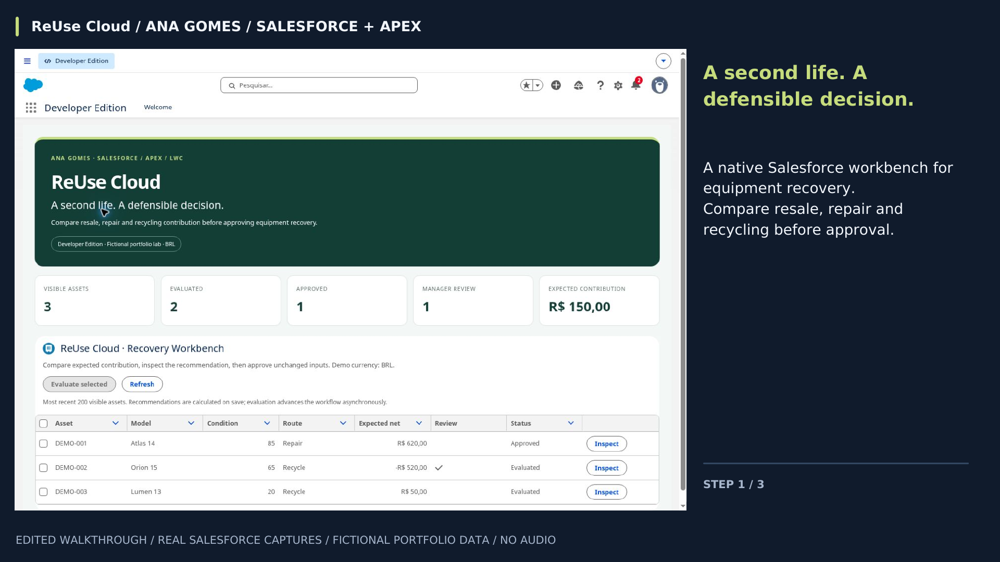

# ReUse Cloud

Native Salesforce application built with **Apex + Lightning Web Components**.



**Deployment: Succeeded | Apex tests: 15 passed | Fictional portfolio lab**

Built a native Salesforce equipment-recovery application using Apex and Lightning Web Components. The explainable decision engine compares eligible resale, repair and recycling routes after credit, logistics and repair risk. The three fictional demo assets show Repair / 620 / Approved, Recycle / -520 / manager review, and Recycle / 50 / Evaluated. Fifteen Apex tests passed in Salesforce; the decision engine reached 100% coverage in the recorded test run. Inputs changed after approval require reevaluation.

## Watch and inspect

- [Case study PDF](portfolio/CASE-STUDY.pdf)
- [Overview video](portfolio/videos/ReUseCloud_01_Overview.mp4)
- [Workflow explainer](portfolio/videos/ReUseCloud_02_DecisionFlow.mp4)
- [Original Salesforce screenshots](portfolio/screenshots/)
- [Current verified results](portfolio/capture-verification-2026-10-04.json)
- [Deployment and coverage](portfolio/salesforce-deployment.json)
- [Upwork copy](portfolio/UPWORK-DRAFT.md)

Videos are edited presentations using real captures, with explanatory titles and fades. They are not continuous screen recordings. Scope and limitations: [implementation status](portfolio/IMPLEMENTATION-STATUS.md).

## Repository structure

| Folder | Purpose |
|---|---|
| `force-app/main/default/classes/` | Apex business logic and tests |
| `force-app/main/default/lwc/` | Native Lightning Web Components |
| `force-app/main/default/objects/` | Salesforce object and field metadata |
| `force-app/main/default/permissionsets/` | Project access roles |
| `scripts/` | Demo seeding, installation and validation helpers |
| `portfolio/` | Real captures, PDFs, MP4s and case evidence |
| `portfolio/editing/` | Reproducible video editing source |
| `portfolio/archive/` | Previous descriptions preserved for history |

## Deploy to your own Developer Edition

Requires Salesforce CLI and an authorized Developer/scratch org. Run from this repository root:

```bash
sf org login web --alias portfolio-dev
sf project deploy start --source-dir force-app --target-org portfolio-dev --test-level RunLocalTests
sf org assign permset --name Recovery_Operator --target-org portfolio-dev
sf org assign permset --name Recovery_Manager --target-org portfolio-dev
sf apex run --file scripts/seed.apex --target-org portfolio-dev
```

The permission commands assign roles to the authenticated deploying user. Review privileges before using another account. Open App Launcher and search for **ReUseCloud Workbench**. This custom tab runs the deployed LWC inside Salesforce.

Use a fresh demo org for seeding. Rerunning seed scripts can change demo inputs or conflict with existing inventory. Dates are relative to seed time; expired event starts must be moved forward for a later EncoreOps demonstration without resetting inventory.

## Verification

The packaged deployment responses record the successful native Apex test run. No Apex source changed during this media update. Refer to [VALIDATION.md](VALIDATION.md) for the original test workflow and [portfolio evidence](portfolio/README.md) for provenance.

## Presentation boundaries

All demo records are fictional. No payments or real client outcomes are claimed. UI monetary labels use BRL for this demo; they are not proof of multi-currency accounting. The org requires login; screenshots, source and edited videos are the client-facing evidence.

Historical offline HTML and design material, when present under `docs/`, remains reference material; the deployed application source is under `force-app/`. It is not the primary platform evidence.
