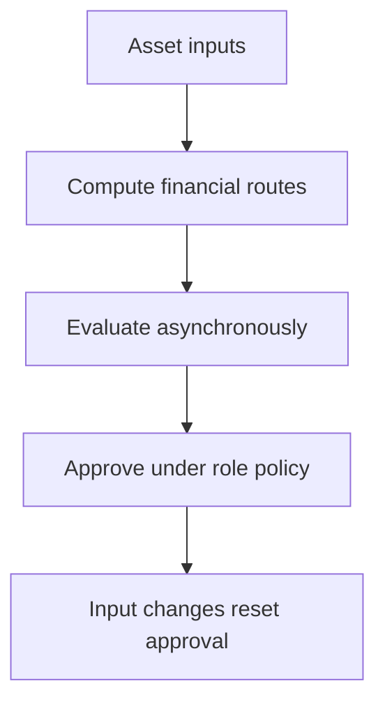

# ReUse Cloud: verified native Salesforce implementation

Deployment: **Succeeded**. ID: `0Afg700000EES0TCAX`. Apex tests: **15 passed**, zero failures.

Native components: Apex, Lightning Web Components, custom objects, Lightning application and tabs, isolated project permission sets.

## Verified live API workflow

3 synthetic assets evaluated; DEMO-001 approved for Repair with expected contribution 620; DEMO-002 routed to Recycle with expected contribution -520 and review flagged; DEMO-003 routed to Recycle with expected contribution 50.

See `live-api-verification.json` for actual Salesforce API responses. These are implementation evidence; they are not screenshots of the UI. All demo records are fictional portfolio data. Financial actions only record demo ledger values.

## Current delivery status

- Project permission sets assigned only to Ana after specific authorization.
- Demo data loaded; live Apex workflows verified through Salesforce API.
- Original real deployment screenshots included.
- Application UI screenshots and screen recording pending browser sign-in.
- Temporary API client restricted to Ana, certificate and authorization expiring on 5 October; final revocation remains pending completion of verification.

No credentials, keys or tokens are included.
